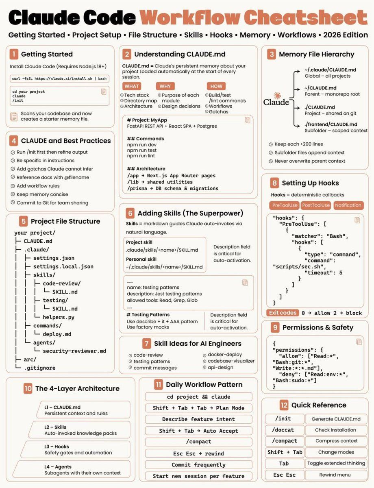

# Claude Code Notes

## Lean Claude Code

Start a session without project extras, MCP servers from other configs, or tools beyond the core set:

```bash
claude --bare --strict-mcp-config --tools "Bash,Read,Grep,Glob,Edit,Write"
```

## Proxy Settings

[`settings-proxy.json`](settings-proxy.json) runs Claude Code through a local model proxy at `127.0.0.1:18765` with non-Anthropic models. Its permissions predate [`.claude/settings.ask.json`](../../.claude/settings.ask.json); reuse the `env` block and take permissions from there.

## Articles

- [Claude Code Tutorial for Beginners](CLAUDE_BEGINEER.md): setup, CLAUDE.md, and real costs.
- [.claude Folder Structure Explained](CLAUDE_FOLDER.md): every file in `.claude/` and when it loads.
- [CLAUDE.md for .NET](CLAUDE_MD.md): copy-paste CLAUDE.md templates.

## Cheatsheet


